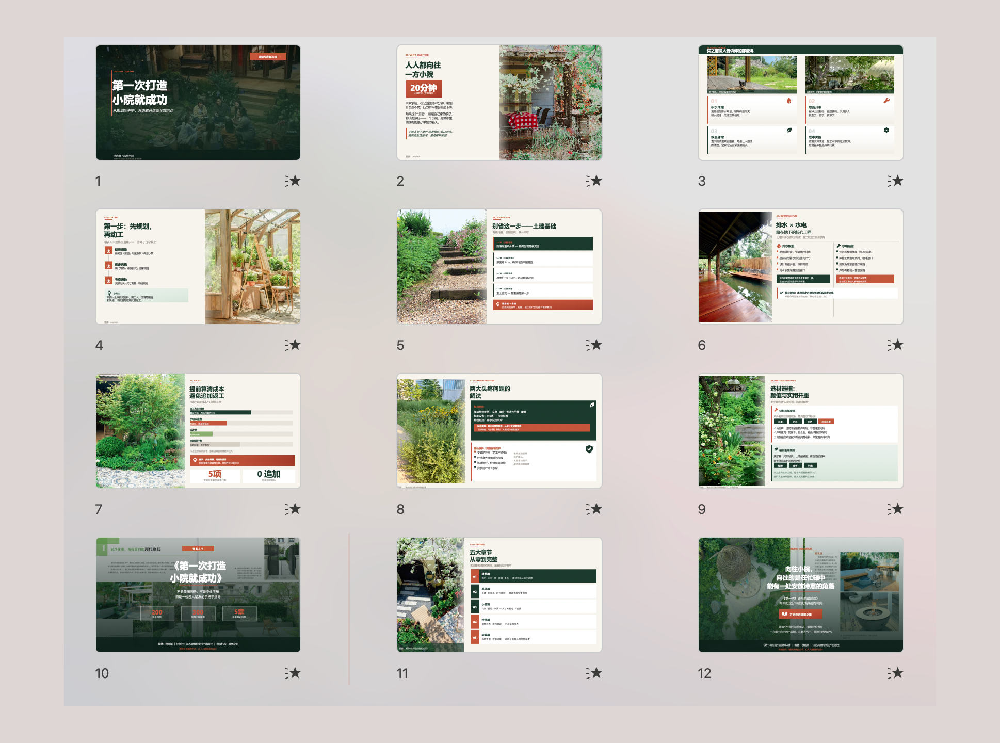
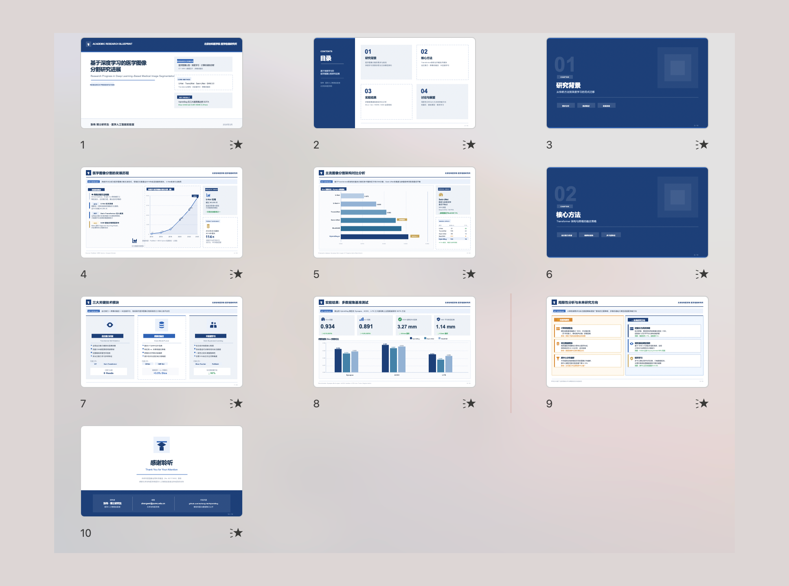
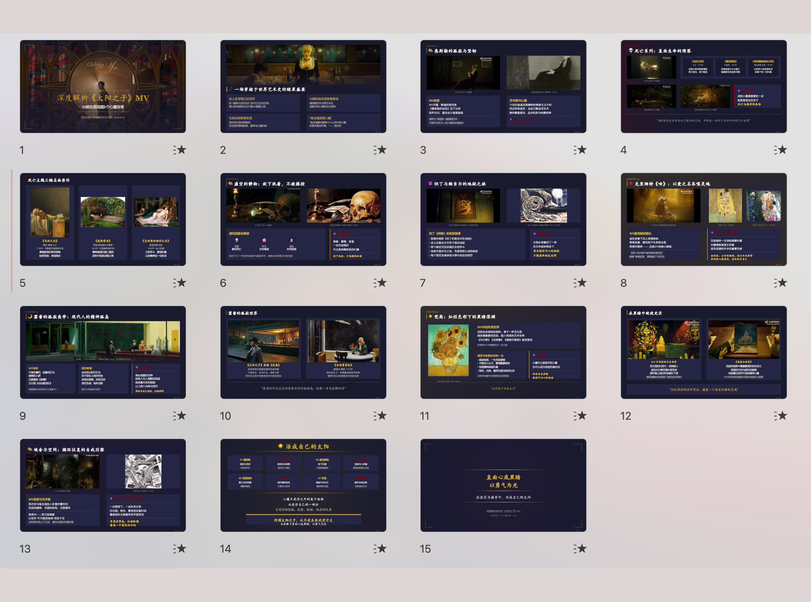
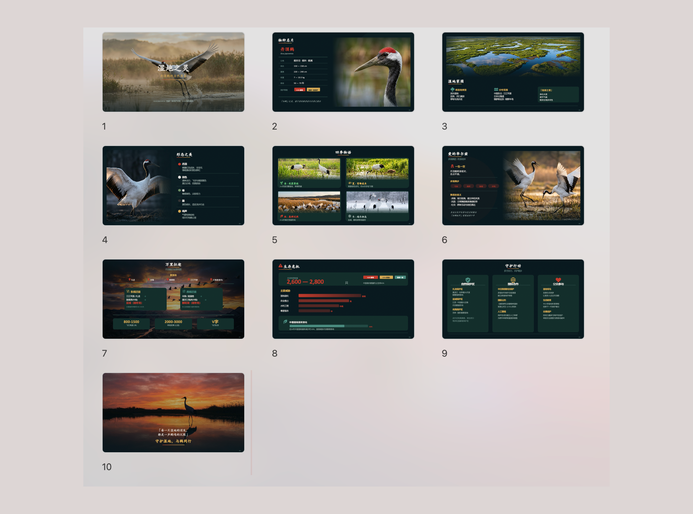
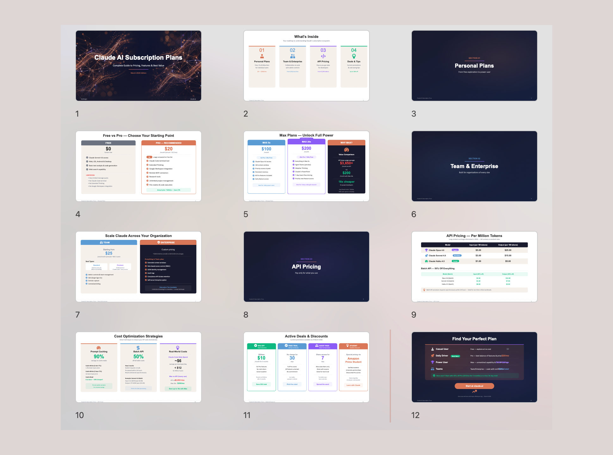
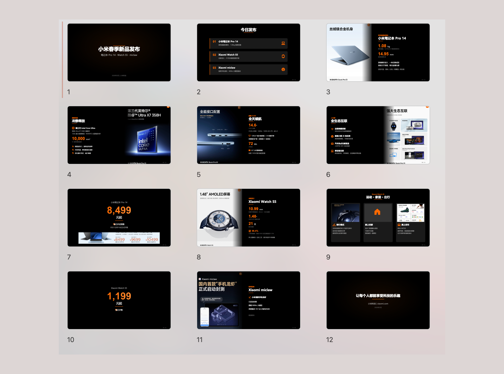

# PPT Master — AI 生成原生可编辑 PPTX，支持任意文档输入

------

丢进一份 PDF、DOCX、网址或 Markdown，拿回一份**原生可编辑的 PowerPoint**——真正的形状、真正的文本框、真正的图表，不是图片。点击任何元素即可编辑。

> **⚠️ PPT Master 是 harness，不是完整的 agent。** `harness + model = agent`——工具负责工作流，模型决定上限。要组成真正高质量的 agent，推荐组合是：**Claude 大上下文窗口（~100 万 token）+ AI 生图（`gpt-image-2`）**。其他模型能跑流程，但达不到同等质量上限。效果不理想，请先换模型，不要质疑 harness。（注：本部署已禁用 AI 生图，配图请使用用户提供的素材。）

> **模板复刻** —— 把任何一份你喜欢的 `.pptx` 丢给 AI，一句"用 `/create-template` 复刻成模板"，就能拿到一套可被 PPT Master 直接调用的页面布局——主题色、字体、母版/版式结构、复用图片、甚至精灵图裁剪关系都按 OOXML 真实抽取，封面/章节/装饰繁复的页面都能稳定还原。从此你不再受限于内置模板：公司品牌 deck、客户中标模板、找的高质量参考稿，都能一键变成你的私人模板库。详见 [模板指南 →](./docs/zh/templates-guide.md)。

> **动画** —— 导出的 deck 支持**页间转场**和**页内元素入场动画**，输出为真正的 OOXML 动画（不是嵌入视频）。默认进入页面后元素按顺序自动级联入场，无需点击；在 PowerPoint 和 Keynote 中原生播放，无需额外工具。详见 [转场与动画使用指南 →](./docs/zh/animations.md)。

> **旁白与视频** —— 把演讲者备注按页生成语音旁白（默认 `edge-tts`，也可配置云端 TTS 获得高质量音色），把音频嵌回 PPTX，再用 PowerPoint 自带"导出视频"产出带旁白和转场的 MP4，全程无需第三方工具。详见 [音频旁白与视频导出 →](./docs/zh/audio-narration.md)。（注：本部署已禁用旁白/视频导出，勿触发 generate-audio 工作流。）
>
> **声音复刻** —— 用 ElevenLabs / MiniMax / Qwen / CosyVoice 复刻出你自己的声音（或在授权前提下复刻演讲者的声音），让整份 deck 用 *你的声音* 念出来。在 provider 控制台复刻一次，把得到的 `voice_id` 传进来，PPT Master 就会用这个音色逐页朗读备注并嵌入回 PPTX。详见 [使用复刻音色 →](./docs/zh/audio-narration.md#使用复刻音色)。（注：本部署已禁用。）

> **运作方式** —— PPT Master 是一套在 AI IDE（Claude Code / Cursor / VS Code + Copilot / Codebuddy 等）里运行的工作流（一个 "skill"）。你在 IDE 的对话框里跟 AI 说"用这份 PDF 做一份 PPT"，AI 按这套工作流在你本机生成一个真正可编辑的 `.pptx`。你不写任何代码——IDE 只是你和 AI 对话的地方。
>
> **你要做的**：装 Python、装一个 AI IDE、把资料放进来。

PPT Master 不一样：

- **真正的 PPT** — 如果一个文件在 PowerPoint 里打不开、不能编辑，它就不应该被叫做 PPT。PPT Master 输出的每个元素都能直接点击修改
- **成本透明可控** — 工具免费开源，唯一成本是你自己的 AI 模型用量。当前主流 AI 工具都已转向按量计费，你用多少付多少——PPT Master 不在此之外增加任何额外订阅费用
- **数据不出本地** — 你的文件不应该为了做一份 PPT 就被上传到别人的服务器。除与 AI 模型的对话外，全流程在你的电脑上完成
- **不锁定平台** — 你的工作流不应该被任何一家公司绑架。Claude Code、Cursor、VS Code Copilot 等均可驱动；Claude、GPT、Gemini、Kimi 等模型均可使用

市面上的 AI PPT 工具大致分四类，PPT Master 只做最后一类：

| 类型 | 产物形态 | 能在 PowerPoint 里逐元素改吗 |
|---|---|:---:|
| 模板填空 | 套模板的 PPTX | 部分可以，受模板限制 |
| 图片式 | 一页一张大图拼成 PPTX | ❌ 整页是图片 |
| HTML 演示 | 网页演示 | ❌ 不是 PPTX |
| **原生可编辑（PPT Master）** | **真 DrawingML 形状、文本框、图表** | ✅ 每个元素都能点开改 |


## 效果展示

<table>
  <tr>
    <td align="center"><br/><sub><b>杂志风</b> — 暖色调，大图排版，生活方式感</sub></td>
    <td align="center"><br/><sub><b>学术风</b> — 严谨结构，数据图表，论文答辩场景</sub></td>
  </tr>
  <tr>
    <td align="center"><br/><sub><b>暗色艺术风</b> — 电影感深色背景，美术馆陈列感</sub></td>
    <td align="center"><br/><sub><b>自然纪录风</b> — 沉浸式摄影，简洁信息层级</sub></td>
  </tr>
  <tr>
    <td align="center"><br/><sub><b>科技 / SaaS 风</b> — 白底卡片，定价表格，产品说明书</sub></td>
    <td align="center"><br/><sub><b>发布会风</b> — 高对比度，参数突出，苹果/小米发布会感</sub></td>
  </tr>
</table>


---

## 快速开始

### 1. 前置条件

**只需装 Python 即可。** 其余依赖通过 `pip install -r requirements.txt` 一次装齐。

| 依赖 | 是否必须 | 用途 |
|------|:--------:|------|
| [Python](https://www.python.org/downloads/) 3.10+ | ✅ **必需** | 核心运行时——唯一真正需要安装的东西 |

> **一句话总结** — 装好 Python，跑一行 `pip install -r requirements.txt`，就可以开始生成 PPT 了。

<details open>
<summary><strong>Windows</strong> — 请看专门的手把手安装指南 ⚠️</summary>

Windows 需要一些额外步骤（PATH 设置、执行策略等）。我们为 Windows 用户写了一份**手把手安装指南**：

**📖 [Windows 安装指南](./docs/zh/windows-installation.md)** — 从零到跑通第一份 PPT，10 分钟搞定。

简要流程：从 [python.org](https://www.python.org/downloads/) 下载 Python → **安装时勾选 "Add to PATH"** → `pip install -r requirements.txt` → 完成。
</details>

<details>
<summary><strong>macOS / Linux</strong> — 安装即用</summary>

```bash
# macOS
brew install python
pip install -r requirements.txt

# Ubuntu / Debian
sudo apt install python3 python3-pip
pip install -r requirements.txt
```
</details>

<details>
<summary><strong>边缘场景备用方案</strong> — 99% 的用户用不到</summary>

**Pandoc** — 只在需要转小众格式时才装：`.doc`、`.odt`、`.rtf`、`.tex`、`.rst`、`.org`、`.typ`。`.docx`、`.html`、`.epub`、`.ipynb` 已由 Python 原生处理，不需要 pandoc。

```bash
# macOS
brew install pandoc

# Ubuntu / Debian
sudo apt install pandoc
```
</details>

### 2. 选择一个 Agent

PPT Master 在**任何具备 agent 能力**（可读写文件、执行命令、持续多轮对话）的工具里都能跑。

| 类型 | 代表工具 | 说明 |
|---|---|---|
| **IDE 内置 agent** | • VS Code 架构（含 [VS Code](https://code.visualstudio.com/) 本体及分支与衍生）：[Cursor](https://cursor.sh/)、Trae、Codebuddy IDE、[Windsurf](https://codeium.com/windsurf)、Void 等<br>• 其他架构：[Zed](https://zed.dev/) 等 | 编辑器原生集成 agent |
| **IDE 插件 / 扩展** | [GitHub Copilot](https://github.com/features/copilot)、[Claude Code](https://claude.ai/code)（VS Code / JetBrains 扩展）、[Cline](https://cline.bot/)、[Continue](https://continue.dev/)、Roo Code、通义灵码、CodeGeeX 等 | 装在 VS Code / JetBrains 等宿主里使用 |
| **CLI agent** | [Claude Code](https://claude.ai/code) CLI、[Codex CLI](https://github.com/openai/codex)、[Aider](https://aider.chat/)、Gemini CLI 等 | 终端里运行，适合脚本化 / 远程 / 服务器场景 |

> **模型推荐**：优先选 **Claude Opus / Sonnet**，搭配大上下文窗口——原因见上方说明。（注：本部署已禁用 AI 生图。）

**🔑 想用 Claude / GPT / Gemini 但还没有渠道？** 本项目赞助商 **[PackyCode](https://www.packyapi.com/register?aff=ppt-master)** 可以解决大多数卡点——没有 API Key、无法直连、没有境外信用卡无法订阅、或者只是不想为偶尔使用付整月费，PackyCode 都能让你按量调用 Claude、GPT、Gemini 等主流模型，**直接用上推荐的 Claude 模型**，支持国内支付，开箱即用。充值时填写优惠码 **`ppt-master`** 享 9 折。

### 3. 配置项目

**方式 A — 下载 ZIP**（无需安装 Git）：
[GitHub](https://github.com/hugohe3/ppt-master) → **Code → Download ZIP** · [AtomGit](https://atomgit.com/hugohe3/ppt-master) → **克隆/下载 → 下载ZIP**（国内网速更快）

**方式 B — Git clone**（需先安装 [Git](https://git-scm.com/downloads)）：

```bash
# GitHub
git clone https://github.com/hugohe3/ppt-master.git
# AtomGit（国内网速更快）
git clone https://atomgit.com/hugohe3/ppt-master.git
cd ppt-master
```

然后安装依赖：

```bash
pip install -r requirements.txt
```

日常更新（方式 A / B）：`python3 skills/ppt-master/scripts/update_repo.py`

> **方式 C — Skill marketplace**：仓库已添加 `.claude-plugin/marketplace.json` 元数据，可通过 [Claude Code plugin marketplace](https://code.claude.com/docs/en/plugin-marketplaces) 生态一行安装：
>
> ```bash
> # 跨 agent CLI（Claude Code、Cursor、Codex 等）
> npx skills add hugohe3/ppt-master
>
> # 或在 Claude Code 内
> /plugin marketplace add hugohe3/ppt-master
> /plugin install ppt-master@ppt-master
> ```
>
> 上述两种安装方式都只会拉取 skill 文件本身（不含完整仓库），后处理脚本仍需在安装目录跑 `pip install -r requirements.txt`。

### 4. 开始创作

**提供原始材料（推荐）：** 将 PDF、DOCX、图片等文件放入 `projects/` 目录下，在 AI 聊天面板中告诉它使用哪些文件。获取路径的最快方式：在文件管理器或 IDE 侧边栏中右键文件 → **复制路径**（Copy Path / Copy Relative Path），直接粘贴进聊天框。

```
你：请用 projects/q3-report/sources/report.pdf 这份文件生成一份 PPT
```

**直接输入内容：** 也可以把文字内容直接粘贴进聊天窗口，AI 会根据这些内容生成 PPT。

```
你：请根据以下内容制作成 PPT：[粘贴你的文字内容...]
```

两种方式下 AI 都会先确认设计规范：

```
AI：好的，先确认设计规范：
   [模板] B) 自由设计
   [格式] PPT 16:9
   [页数] 8-10 页
   ...
```

AI 全程处理——内容分析、视觉设计、SVG 生成、PPTX 导出。

> **输出说明：** 原生形状版主 `.pptx`（可直接编辑）保存至 `exports/<name>_<timestamp>.pptx`；SVG 快照版 `_svg.pptx` 与 `svg_output/` 副本归档至 `backup/<timestamp>/`，便于回溯视觉参考或免去 LLM 重跑直接重建 pptx。需要 Office 2016+。

> **AI 迷失上下文？** 让它先读 `skills/ppt-master/SKILL.md`。

> **遇到问题？** 查看 **[常见问题](./docs/zh/faq.md)** — 涵盖模型选择、排版问题、导出异常等，基于真实用户反馈持续更新。

### 5. 图片获取（可选）

非用户自带图片有两条路径，可在同一份 deck 里按行混用：

需要 API 的功能统一通过 `.env` 配置。clone 安装可以用 `cp .env.example .env`；skill marketplace 安装建议使用持久的用户级配置：

```bash
mkdir -p ~/.ppt-master
cp /path/to/installed/ppt-master/.env.example ~/.ppt-master/.env
```

PPT Master 会优先读取当前进程环境变量，然后按顺序读取第一个存在的 `.env`：当前工作目录、clone 仓库根目录、`~/.ppt-master/.env`。

**A) AI 生图** — **本部署已永久禁用**。`image_gen.py` 拒绝运行；配图一律使用用户提供的素材（`Acquire Via: user`）。原实现保留为 `_main_impl()` 供参考，不再可调用。

**B) 网络图片搜索** — **本部署已永久禁用**。`image_search.py` 拒绝运行；不启用任何网络搜图能力。

> 完整说明（供参考，均已禁用）：[`image-generator.md`](./skills/ppt-master/references/image-generator.md)（AI）·[`image-searcher.md`](./skills/ppt-master/references/image-searcher.md)（网络）。

---

## 文档导航

| | 文档 | 说明 |
|---|------|------|
| 🆚 | [为什么选 PPT Master](./docs/zh/why-ppt-master.md) | 与 Gamma、Copilot 等工具的对比 |
| 🪟 | [Windows 安装指南](./docs/zh/windows-installation.md) | Windows 用户手把手安装教程 |
| 📖 | [SKILL.md](./skills/ppt-master/SKILL.md) | 核心流程与规则 |
| 🎨 | [模板指南](./docs/zh/templates-guide.md) | 选用、派生新模板（重点）、模板边界；含 standard / fidelity 模式选型 |
| 📐 | [画布格式](./skills/ppt-master/references/canvas-formats.md) | PPT 16:9、小红书、朋友圈等 10+ 种格式 |
| 🎬 | [转场与动画](./docs/zh/animations.md) | 页间转场和页内元素入场动画 |
| 🎙️ | [音频旁白与视频导出](./docs/zh/audio-narration.md) | 90+ 语种 TTS 旁白、音频嵌入 PPTX、导出为 MP4 |
| 🛠️ | [脚本与工具](./skills/ppt-master/scripts/README.md) | 所有脚本和命令 |
| 💼 | [示例](./examples/README.md) | 22 个项目，309 页 |
| 🏗️ | [技术路线](./docs/zh/technical-design.md) | 架构、设计哲学、为什么选 SVG |
| ❓ | [常见问题](./docs/zh/faq.md) | 模型选择、费用、排版问题排查、自定义模板 |
